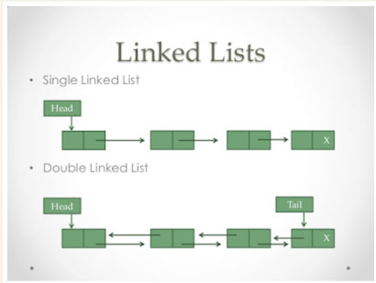

> 해당 구현 내용은, 프로그래밍 언어에 대한 기초가 있어야 이해 가능합니다.
>
>reference variable (비슷한 개념으로는 pointer 가 있음), 반복자 등의 개념 설명은 따로 하지 않습니다.
>
>Java 1.5 이상 문법을 이용하여 작성한 것으로,
>Iterable, Iterator, Generic 등을 이용하여 구현하였습니다.

<br/>



출처 : [https://www.java67.com/2016/01/how-to-implement-singly-linked-list-in-java-using-generics-example.html](https://www.java67.com/2016/01/how-to-implement-singly-linked-list-in-java-using-generics-example.html)

## 🔗 LinkedList란?

간단하게 설명하자면, **같은 형태의 데이터**가 담겨져 있고,
**다음 데이터**를 <span style="color: red">**포인터**</span>로 가리키는 자료구조를 말한다.

> ## 목차
>[1. 배열과의 차이점은?](#1-배열과의-차이점은)
> 
>[2. 자료구조 설계할 때 유의점](#2-자료구조-설계할-때-유의점)
> 
>[3. LinkedList의 시간복잡도](#3-LinkedList의-시간복잡도)
>
>[4. 구현 코드 설명](#4-구현-코드-설명)
>
>[5. 구현 코드](#5-구현-코드)


<br/>

### 1. 배열과의 차이점은?
- 배열은 생성부터 크기를 지정해야하고,
- 연속된 메모리 공간을 사용한다.
- 그렇기 때문에 배열의 중간에 추가, 삭제시 O(n)의 시간복잡도를 가진다.
- 한번 선언된 길이는 변경할 수 없다.
  <br/>
### 2. 자료구조 설계할 때 유의점

1. 자료 구조가 <span style="color: #b71c1c">비어 있을 때</span>
2. 요소가 <span style="color: #b71c1c">하나만 있을 때</span>
3. **시작점**의 요소 **추가 / 제거**
4. **끝 점**의 요소 **추가 / 제거**
5. **중간**의 요소에 대한 작업
   <br/>
### 3. LinkedList의 시간복잡도
- 데이터의 추가 ```O(1)```
    1. 처음과 끝 추가 ```O(1)```
    2. 중간 요소 추가 ```O(n)```
       <br/>
- 데이터의 삭제
    1. 처음과 끝 삭제 ```O(1)```
    2. 중간 요소 삭제 ```O(n)```
       <br/>
### 4. 구현 코드 설명

구현해본 ```LinkedList``` 는,

```Node``` 라는 ```class``` 를 작성한다.

```Node```의 ```field```에는 ```data``` 와 ```next``` 라는 포인터를 가진다.

```LinkedList```의 ```field```에는
```head```, ```tail``` 이 존재하고, 해당 ```field``` 모두 ```Node``` 의 포인터 역할을 한다.

```head```는
자료구조가 비어 있을 때 (```head == null```),
하나만 있을 때, (```head != null```),
시작점의 요소 추가 / 제거 (``` head != null```) 등에서 사용할 것이다.

```tail```은
하나만 있을 때, (```head == tail```),
끝점의 요소 추가 / 제거 등에 사용할 것이다.

<br/>

### 5. 구현 코드
### [LinkedList 구현 코드](./LinkedList.java)


### 구현을 마치며
- 다음 자료구조 포스팅에서는 구현된 ```LikedList```를 이용하여 ```Hash Table``` 을 구현할 예정이다.
- 막상 직접 구현하려니 어려웠다🤣


혹시라도 틀린게 있거나 불편한거 있으시면 댓글 달아주세요!!