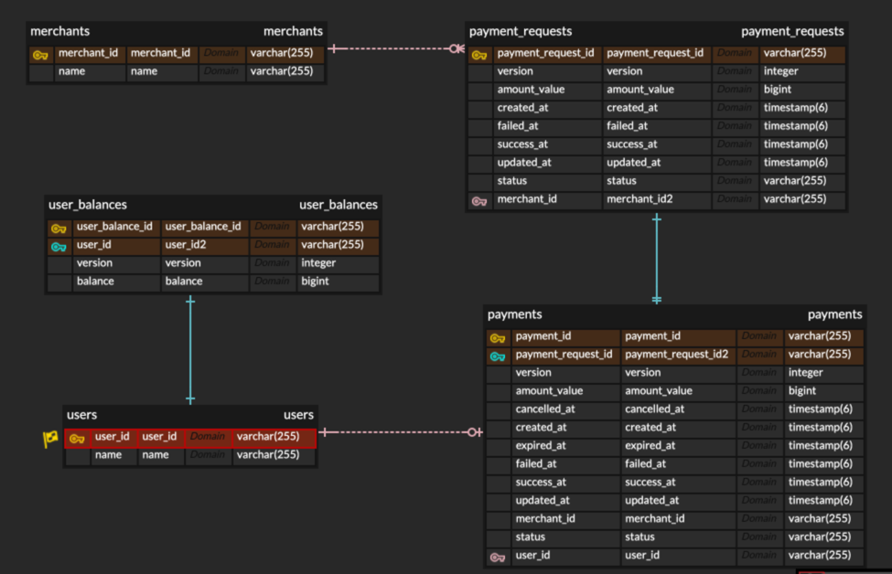

### 패켐 일할맛 2기 과제

[API 흐름 문서](api.puml)

[혹시 몰라서 puml 파싱 링크 제공합니다](https://www.plantuml.com/plantuml/png/tPNlYnj56CVVxr_na3ScOBcgRqfUIA_NLWfAGxR5byTaTvfRs1_hxEpL84AaGPJcHOKgkPAK76fLK8pNzgXGyF_9Jlu79vFDkFiaSnj141feEPxlPvvzVdntzch22UDfu5j7dalXNXJnJlIfPN6F-nJsMxV0ff-aD7GetFIZ-vP571ungCrd_UodFyNqKGr80i4wBCPJCUshs65gnJArvtWn2JdKFjwteTwwtRxJl7BvokM6OkwJf0mTH25daUzJfdIdhDgK7NiELH8ws2AzW8RyUXGGBonoiOl8DesZn9FLzfJEokhrQohgTgotP3gFzw3s4MNEaHHNdL9h5TUFR2_dawpKc24r3-letIJlB2s5hX6VX7d1QSUokYnAOvYVpSHq3EB9Ot7s6uW74p7umo8fZy8qw506xq2jBWTfWVm5SEdzvJYRqBfjtu4z4djxyQg4IsnLOQ9022DEWNdT8mw1ZEXV_fnLY8Qk0dD09bxcTvhWC4euBRTUR-IOiuIIYo5f5EzOgf2N0oepQu9s58ZJsUB9C9VPKdOxcpg8lrvdptujbIr1b0tJSgRpvw-BkPCjiAPqWJ639bf8Imx92xjoCLyi7epp_PIQmYTiSaphZL9QZRGfSNixvPhsnTCVyNISA0WyEMGq1nq7sVnYy08rlbrTxrfCliaUlYmNusYVvMes6orEHcMV1DjKbnPMBqUttUHg_aMJlxlLv1_SC7XyxpFF_Vo_C7gNyWgNOwBIugXNWyqnKsbrVAB2xeO3clpV7F3mXyLtNnTN_rvXzOUf-OBRkDWa_UyNdYV3QyRnDsIvClNgMsseL8kL9IBKN1iYImYQOiNuTf_RxWCpt_pkfWbaK6cfKlAljnPJ9NMKza-miuwAfu_5jwVoINtnR9AhnEVhU7RU5wVhbmsVqpg8qLVYv1Laix5yEp6z8wpRsu6M8FfYtIEUBzl3EZQjuZGb6osU1tclp9-_n4dqMlHXR1AiOPCeSSCYo2G8HHP19j6aHj1TMJr3VNSQwD9Dgk-cmtGtdFe9BRSaRzJXprfdrRDra8RABgdcQY-YbjT-eToyBt7-ItO-C7j-FdialXnY7SlOrrWtEZb97OScoGvcHYXoT2uQJOqux6iiOsiZlThTc3OR7C46ZoFAv0yDL5Z406flJ5valx_IypyRgMPF1jdtGwZVtB_ruTjWtpquk67R3QF7zJ7rng1-AY3K5SBClPbn_1xelvR_hih_qi3_6m00)

### 고민 사항

1. UUID를 사용해서 고유한 엔티티 아이디 부여 및 아이디를 DB에서 채번하지 않도록 구현.
2. 레이어드 아키텍처를 적용하여 도메인 모델을 구현.
3. 애플리케이션 예외와 도메인 예외를 분리하여 구현.
4. 동시성 이슈가 있는 Payment, PaymentRequest, UserBalance 엔티티에 대해 Optimistic Locking을 적용하여 구현.

시간이 부족하여 다음과 같은 고민 사항을 구현하지 못했습니다.

1. 적절한 테스트 코드 작성
2. 이와 같은 고민거리에 대한 정리

