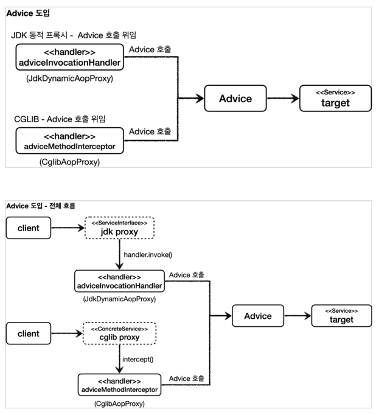
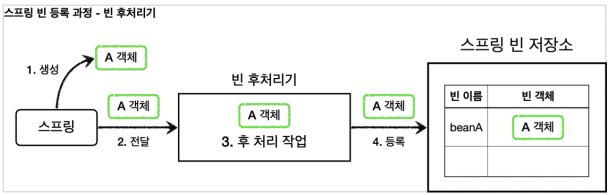
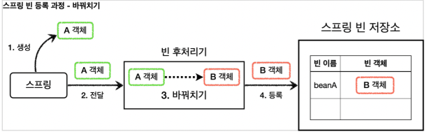
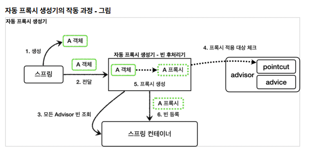
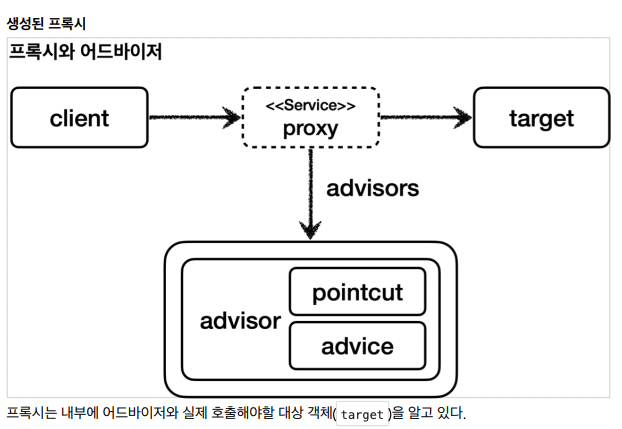

## 프록시 패턴과 데코레이터 패턴
### 클라이언트와 서버
- 일반적으로 클라이언트와 서버라고 하면, 웹 개발자 입장에서는 사용자.<br>
  즉 웹 브라우저가 클라이언트고 브라우저 요청을 처리하는 쪽이 서버라고 이해한다.
- 하지만 여러 분야에 걸쳐 사용하기도 한다.
- 객체에 대입해 생각한다면, 객체에 행위를 호출하는 쪽이 클라이언트고, 이를 처리하는 쪽이 서버라고 부를 수 있다.
- 프록시는 클라이언트와 서버 사이에서 대리자 역할을 수행한다.
- 예를 들어서 라면을 '내가' 끓일 수도 있지만, 어떤 누구에게 부탁을 할 수도 있는 것이다.
- 그 어떤 누구는 '나 말고 다른' 사람이 될 것이다.
- '어떤 누구'는 라면을 끓이고 김치까지 제공할 수 있다.(부가 기능 추가)
- 그리고 그 '어떤 누구'는 그 사람이 또 다른 '어떤 누구'에게 부탁을 할 수도 있는 것이다.(프록시 체인)
- 또 하나의 예로는, 라면을 끓이기 위해서 라면을 사달라고 '어떤 누구'에게 부탁을 했는데, 이미 라면이 있는 경우도 있을 것이다(접근 제어, 캐싱)
- 이 대리자 역할을 수행하는게 프록시라고 한다.

#### 프록시의 주요 기능
프록시를 통해서 할 수 있는 일은 크게 2가지로 구분할 수 있다.
- 접근 제어
  - 권한에 따른 접근 차단
  - 캐싱
  - 지연 로딩
- 부가 기능 추가
  - 원래 서버가 제공하는 기능에 더해서 부가 기능을 수행한다.
  - 예) 요청 값이나, 응답 값을 중간에 변형한다.
  - 예) 실행 시간을 측정해서 추가 로그를 남긴다.
#### GOF 디자인 패턴
둘 다 프록시를 사용하는 방법이지만, GOF 디자인 패턴에서는 이 둘을 의도(intent)에 따라서 프록시 패턴과 데코레이터 패턴으로 구분!
- 프록시 패턴: 접근 제어가 목적
- 데코레이터 패턴: 새로운 기능 추가가 목적<br>
#### 참고
=> 참고로 프록시 패턴이라고 프록시와 프록시 패턴이 같은게 아니다. 프록시 패턴이라고 해서 이 패턴만 프록시를 사용하는 것은 아니다.<br>
=> 데코레이터 패턴도 프록시를 사용한다.

> 참고: 프록시라는 개념은 클라이언트 서버라는 큰 개념 안에서 자연스럽게 발생할 수 있다.<br>
> 프록시는 객체 안에서의 개념도 있고, 웹 서버에서의 프록시도 있다. 객체 안에서 객체로 구현되어 있는가, 웹 서버로<br>
> 구현되어 있는가처럼 규모의 차이가 있을 뿐 근본적인 역할은 같다.

### 프록시 패턴과 데코레이터 패턴 정리

여기서 생각해보면 `Decorator` 기능에 일부 중복이 있다. 꾸며주는 역할을 하는 `Decorator` 들은 스스로<br>
존재할 수 없다. 항상 꾸며줄 대상이 있어야 한다. 따라서 내부에 호출 대상인 `component` 를 가지고 있어야<br>
한다. 그리고 `component` 를 항상 호출해야 한다. 이 부분이 중복이다. 이런 중복을 제거하기 위해<br>
`component` 를 속성으로 가지고 있는 `Decorator` 라는 추상 클래스를 만드는 방법도 고민할 수 있다.<br>
이렇게 하면 추가로 클래스 다이어그램에서 어떤 것이 실제 컴포넌트 인지, 데코레이터인지 명확하게<br>
구분할 수 있다. 여기까지 고민한 것이 바로 GOF에서 설명하는 데코레이터 패턴의 기본 예제이다.<br>

### 프록시 패턴 vs 데코레이터 패턴
- `Decorator`라는 추상 클래스를 만들어야 데코레이터 패턴일까?
- 프록시 패턴과 데코레이터 패턴은 그 모양이 거의 비슷한 거 같다.?

#### 의도(indent)
- 사실 프록시 패턴과 데코레이터 패턴은 그 모양이 거의 같고, 상황에 따라 정말 똑같을 때도 있다.
- 그러면 둘을 어떻게 구분하는 것일까?
- 디자인 패턴에서 중요한 것은 해당 패턴의 겉 모양이 아니라 그 패턴을 만든 의도가 더 중요하다.
- 따라서 의도에 따라 패턴을 구분한다.
<br>
- 프록시 패턴의 의도: 다른 개체에 대한 **접근을 제어**하기 위해 대리자를 제공
- 데코레이터 패턴의 의도: **객체에 추가 책임(기능)을 동적으로 추가**하고, 기능 확장을 위한 유연한 대안 제공
#### 정리
프록시를 사용하고, 해당 프록시가 접근 제어가 목적이라면 프록시 패턴이고, 새로운 기능을 추가하는 것이 목적이라면 데코레이터 패턴이 된다.

### 인터페이스 기반 프록시와 클래스 기반 프록시

#### 인터페이스 기반 프록시 vs 클래스 기반 프록시
- 인터페이스가 없어도 클래스 기반으로 프록시를 생성할 수 있다.
- 클래스 기반 프록시는 해당 클래스에만 적용할 수 있다. 인터페이스 기반 프록시는 인터페이스만 같으면 모든 곳에 적용할 수 있다.
- 클래스 기반 프록시는 상속을 사용하기 때문에 몇가지 제약이 있다.
  - 부모 클래스의 생성자를 호출해야 한다.(앞서 본 예제)
  - 클래스에 final 키워드가 붙으면 상속이 불가능하다.
  - 메서드와 final 키워드가 붙으면 해당 메서드를 오버라이딩 할 수 있다.

이렇게 보면 인터페이스 기반의 프록시가 더 좋아보인다. 맞다. 인터페이스 기반의 프록시는 상속이라는<br>
제약에서 자유롭다. 프로그래밍 관점에서도 인터페이스를 사용하는 것이 역할과 구현을 명확하게 나누기<br>
때문에 더 좋다.<br>
인터페이스 기반 프록시의 단점은 인터페이스가 필요하다는 그 자체이다. 인터페이스가 없으면 인터페이스<br>
기반 프록시를 만들 수 없다.<br>

# 동적 프록시 기술
### 리플렉션
동적 프록시 기술을 이해하려면 자바의 리플렉션을 알아야한다.<br>
리플렉션 기술을 사용하면 클래스나 메서드의 메타정보를 동적으로 획득하고, 코드도 동적으로 호출할 수 있다.<br>
#### 주의
리플렉션을 사용하면 클래스와 메서드의 메타정보를 사용해서 애플리케이션을 동적으로 유연하게 만들 수 있다<br>
하지만 리플렉션 기술은 런타임에 동작하기 때문에, 컴파일 시점에 오류를 잡을 수 없다.<br>
리플렉션을 사용해 해당 코드를 직접 실행하는 시점에 발생하는 오류인 런타임 오류가 발생한다<br>
가장 좋은 오류는 개발자가 즉시 확인할 수 있는 컴파일 오류이고, 가장 무서운 오류는 사용자가 직접 실행할
때 발생하는 런타임 오류다.<br>
따라서 리플렉션은 일반적으로 사용하면 안된다. 지금까지 프로그래밍 언어가 발달하면서 타입 정보를<br>
기반으로 컴파일 시점에 오류를 잡아준 덕분에 개발자가 편하게 살았는데, 리플렉션은 그것에 역행하는<br>
방식이다.<br>
리플렉션은 프레임워크 개발이나 또는 매우 일반적인 공통 처리가 필요할 때 부분적으로 주의해서 사용해야
한다<br>
## JDK 동적 프록시 - 소개
동적 프록시 기술을 사용하면 개발자가 직접 프록시 클래스를 만들지 않아도 된다. 이름 그대로 프록시<br>
객체를 동적으로 런타임에 개발자 대신 만들어준다. 그리고 동적 프록시에 원하는 실행 로직을 지정할 수 있다.<br>
#### 주의
JDK 동적 프록시는 인터페이스를 기반으로 프록시를 동적으로 만들어준다. 따라서 인터페이스가 필수이다!

#### JDK 동적 프록시 - 한계
JDK 동적 프록시는 인터페이스가 필수이다.<br>
그렇다면 V2 애플리케이션처럼 인터페이스 없이 클래스만 있는 경우에는 어떻게 동적 프록시를 적용할 수 있을까?<br>
이것은 일반적인 방법으로는 어렵고 `CGLIB`라는 바이트 코드를 조작하는 특별한 라이브러리를 사용해야 한다.

## CGLIB - 소개
**"CGLIB: Code Generator Library""**<br>
- CGLIB는 바이트코드를 조작해서 동적으로 클래스를 생성하는 기술을 제공하는 라이브러리이다.
- CGLIB를 사용하면 인터페이스가 없어도 구체 클래스만 가지고 동적 프록시를 만들어낼 수 있다.
- CGLIB는 원래는 외부 라이브러리인데, 스프링 프레임워크가 스프링 내부 소스 코드에 포함했다. 따라서 <br>
  스프링을 사용한다면 별도의 외부 라이브러리를 추가하지 않아도 사용할 수 있다.
<br>
참고로 우리가 CGLIB를 직접 사용하는 경우는 거의 없다. 스프링의 `ProxyFactory`라는 것이 이 기술을 편리하게 사용하게 도와주기 때문에,<br>
너무 깊이있게 파기 보다는 CGLIB가 무엇인지 대략 개념만 잡으면 된다.

#### 정리
**남은 문제**<br>
- 인터페이스가 있는 경우에는 JDK 동적 프록시를 적용하고, 그렇지 않은 경우에는 CGLIB를 적용하려면 어떻게 하나?
- 두 기술을 함께 사용할 때 부가 기능을 제공하기 위해서 JDK 동적 프록시가 제공하는 `invocationHandler`와 CGLIB가 제공하는<br>
  `MethodInterceptor`를 각각 중복으로 만들어서 관리해야할까?
- 특정 조건에 맞을 때 프록시 로직을 적용하는 기능도 공통으로 제공되었으면?

# 스프링이 지원하는 프록시
## 프록시 팩토리 - 소개
앞서 동적 프록시를 사용할 때 문제점을 다시 확인해보자.
#### 문제점
- 인터페이스가 있는 경우에는 JDK 동적 프록시를 적용하고, 그렇지 않은 경우에는 CGLIB를 적용하려면 어떻게 해야할까?
- 두 기술을 함께 사용할 때 부가 기능을 제공하기 위해 JDK 동적 프록시가 제공하는 `InvocationHandler`와<br>
  CGLIB가 제공하는 `MethodInterceptor`를 각각 중복으로 만들어서 관리해야할까?
- 특정 조건에 맞을 때 프록시 로직을 적용하는 기능도 공통으로 제공되었으면 한다.

**Q: 인터페이스가 있는 경우에는 JDK 동적 프록시를 적용하고, 그렇지 않은 경우에는 CGLIB를 적용하려면 어떻게 해야할까?**<br>
스프링은 유사한 구체적인 기술들이 있을 때, 그것들을 통합해서 일관성 있게 접근할 수 있고, 더욱 편리하게<br>
사용할 수 있는 추상화된 기술을 제공한다.<br>
스프링은 동적 프록시를 통합해서 편리하게 만들어주는 프록시 팩토리( ProxyFactory )라는 기능을 제공한다.<br>
이전에는 상황에 따라서 JDK 동적 프록시를 사용하거나 CGLIB를 사용해야 했다면, 이제는 이 프록시 팩토리(`ProxyFactory`) 하나로 편리하게 동적 프록시를 생성할 수 있다.<br>
프록시 팩토리는 인터페이스가 있으면 JDK 동적 프록시를 사용하고, 구체 클래스만 있다면 CGLIB를 사용한다.<br>
그리고 이 설정을 변경할 수도 있다.

프록시 팩토리<br>


**Q: 두 기술을 함께 사용할 때 부가기능을 적용하기 위해 JDK 동적 프록시가 제공하는 <br>
InvocationHandler와 CGLIB가 제공하는 MethodInterceptor를 각각 중복으로 따로 만들어야 할까?**
- 스프링은 이 문제를 해결하기 위해 부가 기능을 적용할 때 `Advice` 라는 새로운 개념을 도입했다. 
- 개발자는 `InvocationHandler` 나 `MethodInterceptor` 를 신경쓰지 않고, `Advice` 만 만들면 된다.
- 결과적으로 `InvocationHandler` 나 `MethodInterceptor` 는 `Advice` 를 호출하게 된다.
- 프록시 팩토리를 사용하면 `Advice` 를 호출하는 전용 `InvocationHandler` , `MethodInterceptor` 를
내부에서 사용한다

**Q: 특정 조건에 맞을 때 프록시 로직을 적용하는 기능도 공통으로 제공되었으면?**
- 앞서 특정 메서드 이름의 조건에 맞을 때만(Pattern을 이용) 프록시 부가 기능이 적용되는 코드를 직접 만들었다.
- 스프링은 `Pointcut`이라는 개념을 도입해서 이 문제를 일관성 있게 해결한다.

#### Advice 만들기
`Advice`는 프록시에 적용하는 부가 기능 로직이다. 이 것은 JDK 동적 프록시가 제공하는<br>
`InvocationHandler`와 CGLIB가 제공하는 `MethodInterceptor`의 개념과 유사하다. 둘을 개념적으로 추상화 한 것이다.<br>
프록시 팩토리를 사용하면 둘 대신에 `Advice`를 사용하면 된다.<br>
Advice를 만드는 방법은 여러가지가 있지만, 기본 적인 방법은 `org.aopalliance.intercept.MethodInterceptor`를 구현하면 된다.<br>
```java
package org.aopalliance.intercept;
  public interface MethodInterceptor extends Interceptor {
   Object invoke(MethodInvocation invocation) throws Throwable;
  }
```
- `MethodInvocation invocation`
  - 내부에는 다음 메서드를 호출하는 방법, 현재 프록시 객체 인스턴스, `args`, 메서드 정보 등이<br>
    포함되어 있다. 기존에 파라미터로 제공되는 부분들이 이 안으로 모두 들어갔다고 생각하면 된다.
- CGLIB의 `MethodInterceptor`와 이름이 같으므로 패키지 이름에 주의하자!
  - 참고로 여기서 사용하는 `org.aopalliance.intercept` 패키지는 스프링 AOP 모듈( `spring-top` )
    안에 들어있다.
- `MethodInterceptor` 는 `Interceptor` 를 상속하고 `Interceptor` 는 `Advice` 인터페이스를 상속한다.
#### 프록시 팩토리의 기술 선택 방법
- 대상에 인터페이스가 있으면: JDK 동적 프록시, 인터페이스 기반 프록시
- 대상에 인터페이스가 없으면: CGLIB, 구체 클래스 기반 프록시
- `proxyTargetClass=true` : CGLIB, 구체 클래스 기반 프록시, 인터페이스 여부와 상관없음

### 정리
- 프록시 팩토리의 서비스 추상화 덕분에 구체적인 CGLIB, JDK 동적 프록시 기술에 의존하지 않고, 매우<br>
  편리하게 동적 프록시를 생성할 수 있다.
- 프록시의 부가 기능 로직도 특정 기술에 종속적이지 않게 Advice 하나로 편리하게 사용할 수 있었다.<br>
  이것은 프록시 팩토리가 내부에서 JDK 동적 프록시인 경우 `InvocationHandler` 가 `Advice` 를<br>
  호출하도록 개발해두고, CGLIB인 경우 `MethodInterceptor` 가 `Advice` 를 호출하도록 기능을<br>
  개발해두었기 때문이다.<br>

> **참고**<br>
> 스프링 부트는 AOp를 적용할 때 기본적으로 `proxyTargetClass=true`로 설정해서 사용한다.<br>
> 따라서 인터페이스가 있어도 항상 CGLIB를 사용해서 구체 클래스를 기반으로 프록시를 생성한다.

## 포인트컷, 어드바이스, 어드바이저 - 소개
- **포인트컷**(`Pointcut`): 어디에 부가 기능을 적용할지, 어디에 부가 기능을 적용하지 않을지 판단하는 필터링 로직이다.<br>
  주로 클래스와 메서드 이름으로 필터링 한다. 이름 그대로 어떤 포인트(Point)에 기능을<br>
  적용할지 하지 않을지 잘라서(cut) 구분하는 것이다.
- 어드바이스( `Advice` ): 이전에 본 것 처럼 프록시가 호출하는 부가 기능이다. 단순하게 프록시 로직이라<br>
  생각하면 된다.
- 어드바이저( `Advisor` ): 단순하게 하나의 포인트컷과 하나의 어드바이스를 가지고 있는 것이다. 쉽게<br>
  이야기해서 포인트컷1 + 어드바이스1이다.

#### "쉽게 기억하기"
- 조언(`Advice`)을 어디(`Pointcut`)에 할 것인가?
- 조언자(`Advisor`)는 어디(`Pointcut`)에 조언(`Advice`)을 해야할지 알고 있다.

#### "역할과 책임"
이렇게 구분한 것은 역할과 책임을 명확하게 분리한 것이다.
- 포인트 컷은 대상 여부를 확인하는 필터 역할만 담당한다.
- 어드바이스는 깔끔하게 부가 기능 로직만 담당한다.
- 둘을 합치면 어드바이저가 된다. 스프링의 어드바이저는 하나의 포인트컷 + 하나의 어드바이스로 구성된다.

> #### "중요"
> 스프링의 AOP를 처음 공부하거나 사용하면, AOP 적용 수 만큼 프록시가 생성된다고 착각하게 된다.<br>
> 스프링은 AOP를 적용할 때, 최적화를 진행해서 지금처럼 프록시는 하나만 만들고, 하나의 프록시에 여러 어드바이저를 적용.<br>
> 정리하면 하나의 `target`에 여러 AOP가 동시에 적용되어도, 스프링의 AOP는 `target`마다 **하나의 프록시만 생성**한다.

### 정리
프록시 팩토리 덕분에 개발자는 매우 편리하게 프록시를 생성할 수 있게 되었다.<br>
추가로 어드바이저, 어드바이스, 포인트컷 이라는 개념 덕분에 어떤 부가 기능을 어디에 적용할 지 명확하게 이해할 수 있었다.
#### 남은 문제
프록시 팩토리와 어드바이저 같은 개념 덕분에 지금까지 고민했던 문제들은 해결되었다. 프록시도 깔끔하게<br>
적용하고 포인트컷으로 어디에 부가 기능을 적용할지도 명확하게 정의할 수 있다. 원본 코드를 전혀 손대지<br>
않고 프록시를 통해 부가 기능도 적용할 수 있었다.<br>
그런데 아직 해결되지 않는 문제가 있다.
#### 문제1 - 너무 많은 설정
바로 `ProxyFactoryConfigV1` , `ProxyFactoryConfigV2` 와 같은 설정 파일이 지나치게 많다는 점이다.<br>
예를 들어서 애플리케이션에 스프링 빈이 100개가 있다면 여기에 프록시를 통해 부가 기능을 적용하려면<br>
100개의 동적 프록시 생성 코드를 만들어야 한다!<br>
최근에는 스프링 빈을 등록하기 귀찮아서 컴포넌트 스캔까지 사용하는데, 이렇게 직접 등록하는 것도<br>
모자라서, 프록시를 적용하는 코드까지 빈 생성 코드에 넣어야 한다.
#### 문제2 - 컴포넌트 스캔
구체 클래스 컴포넌트 스캔을 사용하는 경우 지금까지 학습한 방법으로는 프록시 적용이 불가능하다.<br>
왜냐하면 실제 객체를 컴포넌트 스캔으로 스프링 컨테이너에 스프링 빈으로 등록을 다 해버린 상태이기 때문이다.<br>
지금까지 학습한 프록시를 적용하려면, 실제 객체를 스프링 컨테이너에 빈으로 등록하는 것이 아니라<br> 
`ProxyFactoryConfigV1` 에서 한 것 처럼, 부가 기능이 있는 프록시를 실제 객체 대신 스프링 컨테이너에<br>
빈으로 등록해야 한다.

# 빈 후처리기
`@Bean` 이나 컴포넌트 스캔으로 스프링 빈을 등록하면, 스프링은 대상 객체를 생성하고 스프링 컨테이너
내부의 빈 저장소에 등록한다. 그리고 이후에는 스프링 컨테이너를 통해 등록한 스프링 빈을 조회해서
사용하면 된다.<br>

#### 빈 후처리기 - BeanPostProcessor
스프링이 빈 저장소에 등록할 목적으로 생성한 객체를 빈 저장소에 등록하기 직전에 조작하고 싶다면 빈 후처리기를 사용하면 된다.<br>
빈 포스트 프로세서( `BeanPostProcessor` )는 번역하면 빈 후처리기인데, 이름 그대로 빈을 생성한 후에 무언가를 처리하는 용도로 사용한다.<br>

#### 빈 후처리기 기능
빈 후처리기의 기능은 막강하다.<br>
객체를 조작할 수도 있고, 완전히 다른 객체로 바꿔치기 하는 것도 가능하다.<br>
빈 후처리기 과정

#### 빈 등록 과정을 빈 후처리기와 함께 살펴보자
- 1. 생성: 스프링 빈 대상이 되는 객체를 생성한다. ( `@Bean` , 컴포넌트 스캔 모두 포함)
- 2. 전달: 생성된 객체를 빈 저장소에 등록하기 직전에 빈 후처리기에 전달한다.
- 3. 후 처리 작업: 빈 후처리기는 전달된 스프링 빈 객체를 조작하거나 다른 객체로 바뀌치기 할 수 있다.
- 4. 등록: 빈 후처리기는 빈을 반환한다. 전달 된 빈을 그대로 반환하면 해당 빈이 등록되고, 바꿔치기 하면
   다른 객체가 빈 저장소에 등록된다.

#### 다른 객체로 바꿔치는 빈 후처리기


#### 정리
빈 후처리기는 빈을 조작하고 변경할 수 있는 후킹 포인트이다.<br>
이것은 빈 객체를 조작하거나 심지어 다른 객체로 바꾸어 버릴 수 있을 정도로 막강하다.<br>
여기서 조작이라는 것은 해당 객체의 특정 메서드를 호출하는 것을 뜻한다.<br>
일반적으로 스프링 컨테이너가 등록하는, 특히 컴포넌트 스캔의 대상이 되는 빈들은 중간에 조작할 방법이<br>
없는데, 빈 후처리기를 사용하면 개발자가 등록하는 모든 빈을 중간에 조작할 수 있다. 이 말은 빈 객체를<br>
프록시로 교체하는 것도 가능하다는 뜻이다.<br>

> **참고 - @PostConstruct의 비밀**<br>
>` @PostConstruct` 는 스프링 빈 생성 이후에 빈을 초기화 하는 역할을 한다. 그런데 생각해보면 빈의 초기화<br>
라는 것이 단순히 `@PostConstruct` 애노테이션이 붙은 초기화 메서드를 한번 호출만 하면 된다. 쉽게<br>
이야기해서 생성된 빈을 한번 조작하는 것이다.<br>
> 따라서 빈을 조작하는 행위를 하는 적절한 빈 후처리기가 있으면 될 것 같다.<br>
> 스프링은 `CommonAnnotationBeanPostProcessor` 라는 빈 후처리기를 자동으로 등록하는데, 여기에서<br>
`@PostConstruct` 애노테이션이 붙은 메서드를 호출한다. 따라서 스프링 스스로도 스프링 내부의 기능을<br>
확장하기 위해 빈 후처리기를 사용한다.<br>

### 빈 후처리기 정리
- 문제 - 너무 많은 설정
  - 프록시를 직접 스프링 빈으로 등록하는 `ProxyFactoryConfigV1`, `ProxyFactoryConfigV2`와 같은 설정 파일은 프록시 관련 설정이 지나치게 많다는 문제가 있음.
  - 예를 들어서 애플리케이션에 스프링 빈이 100개 있다면 여기에 프록시를 통해 부가 기능을 적용하려면 100개의 프록시 설정 코드가 들어가야한다.
  - 스프링 빈을 편리하게 등록하려고 컴포넌트 스캔까지 사용하는데, 이렇게 직접 등록도하고 프록시 적용하는 코드까지 빈 생성 코드에 넣어야 했음.
- 문제 - 컴포넌트 스캔
  - 컴포넌트 스캔으로 이미 스프링 컨테이너에 실제 객체를 스프링 빈으로 등록을 다 해버린 상태다.
  - 빈 후처리기 없이 프록시를 적용하려면, 프록시를 원본 객체 대신 스프링 컨테이너에 빈으로 등록해야한다.
  - 그런데 컴포넌트 스캔은 원본 객체를 스프링 빈으로 자동으로 등록하기 때문에 프록시 적용이 불가.

#### 문제 해결
- 빈 후처리기 덕분에 프록시를 생성하는 부분을 하나로 집중할 수 있다.
- 그리고 컴포넌트 스캔처럼 스프링이 직접 대상을 빈으로 등록하는 경우에도 중간에 빈 등록 과정을 가로채서 원본 대신 프록시를 스프링 빈으로 등록할 수 있다.

#### 하지만 개발자의 욕심은 끝이 없다.
스프링은 프록시를 생성하기 위한 빈 후처리기를 이미 만들어서 제공한다.

> **중요**!!<br>
> 프록시의 적용 대상 여부를 여기서는 간단히 패키지를 기준으로 설정했다.<br> 
> 그런데 잘 생각해보면 포인트컷을 사용하면 더 깔끔할 것 같다.<br>
> 포인트컷은 이미 클래스, 메서드 단위의 필터 기능을 가지고 있기 때문에, 프록시 적용 대상 여부를 정밀하게 설정할 수 있다.<br>
> 참고로 어드바이저는 포인트컷을 가지고 있다. 따라서 어드바이저를 통해 포인트컷을 확인할 수 있다.<br>
> 뒤에서 학습하겠지만 스프링 AOP는 포인트컷을 사용해서 프록시 적용 대상 여부를 체크한다.
>
> 결과적으로 포인트컷은 다음 두 곳에 사용된다.
> 1. 프록시 적용 대상 여부를 체크해서 꼭 필요한 곳에만 프록시를 적용한다. (빈 후처리기 - 자동 프록시
     생성)
> 2. 프록시의 어떤 메서드가 호출 되었을 때 어드바이스를 적용할 지 판단한다. (프록시 내부)

## 스프링이 제공하는 빈 후처리기 1
- 다음을 추가해준다<br>
**build.gradle**
```groovy
implementation 'org.springframework.boot:spring-boot-starter-aop'
```
이 라이브러리를 추가하면 `aspectjweaver`라는 `aspectJ`관련 라이브러리를 등록하고, 스프링 부트가 AOP 관련 클래스를 자동으로 스프링 빈에 등록한다.<br>
스프링 부트가 없던 시절에는 `@EnableAspectJAutoProxy`를 직접 사용해야 했는데, 이 부분을 스프링 부트가 자동으로 처리해준다.<br>
스프링 부트가 활성화 하는 빈은 `AopAutoConfiguration`을 참고!

#### 자동 프록시 생성기 - AutoProxyCreator
- 앞서 이야기한 스프링 부트 자동 설정으로 AnnotationAwareAspectJAutoProxyCreator 라는 빈<br>
후처리기가 스프링 빈에 자동으로 등록된다.
- 이름 그대로 자동으로 프록시를 생성해주는 빈 후처리기이다.
- 이 빈 후처리기는 스프링 빈으로 등록된 Advisor 들을 자동으로 찾아서 프록시가 필요한 곳에 자동으로<br>
프록시를 적용해준다.
- Advisor 안에는 Pointcut 과 Advice 가 이미 모두 포함되어 있다. 따라서 Advisor 만 알고 있으면 그<br>
안에 있는 Pointcut 으로 어떤 스프링 빈에 프록시를 적용해야 할지 알 수 있다. 그리고 Advice 로 부가<br>
기능을 적용하면 된다
  

#### 자동 프록시 생성기 작동 과정
1. 생성: 스프링이 스프링 빈 대상이 되는 객체를 생성한다. ( @Bean , 컴포넌트 스캔 모두 포함)
2. 전달: 생성된 객체를 빈 저장소에 등록하기 직전에 빈 후처리기에 전달한다.
3. 모든 Advisor 빈 조회: 자동 프록시 생성기 - 빈 후처리기는 스프링 컨테이너에서 모든 Advisor 를
   조회한다.
4. 프록시 적용 대상 체크: 앞서 조회한 Advisor 에 포함되어 있는 포인트컷을 사용해서 해당 객체가
   프록시를 적용할 대상인지 아닌지 판단한다. 이때 객체의 클래스 정보는 물론이고, 해당 객체의 모든
   메서드를 포인트컷에 하나하나 모두 매칭해본다. 그래서 조건이 하나라도 만족하면 프록시 적용 대상이
   된다. 예를 들어서 10개의 메서드 중에 하나만 포인트컷 조건에 만족해도 프록시 적용 대상이 된다.
5. 프록시 생성: 프록시 적용 대상이면 프록시를 생성하고 반환해서 프록시를 스프링 빈으로 등록한다. 만약
   프록시 적용 대상이 아니라면 원본 객체를 반환해서 원본 객체를 스프링 빈으로 등록한다.
6. 빈 등록: 반환된 객체는 스프링 빈으로 등록된다.


프록시는 내부에 어드바이저와 실제 호출해야할 대상 객체(`target`)을 알고 있다.

### 중요: 포인트 컷은 2가지에 사용된다
1. 프록시 적용 여부 판단 - 생성 단계
   - 자동 프록시 생성기는 포인트 컷을 사용해서 해당 빈이 프록시를 생성할 필요가 있는지 없는지 체크한다.
   - 클래스 + 메서드 조건을 모두 비교한다. 이 때 모든 메서드를 체크하는데, 포인트 컷 조건에 하나하나 매칭해본다.
   - 만약 조건에 맞는 것이 하나라도 있으면 프록시를 생성한다.
     - 예) `orderControllerV1`은 `request()`,`noLog()`가 있다. 여기서 `request()`가 조건에 만족하므로 프록시를 생성한다.
     - 만약 조건이 맞는 것(`Pointcut`)이 하나도 없으면 프록시를 생성할 필요가 없으므로 프록시를 생성하지 않는다.
2. 어드바이스 적용 여부 판단 - 사용 단계
   - 프록시가 호출 되었을 때 부가 기능인 어드바이스를 적용할지 말지 포인트 컷을 보고 판단한다.
   - 앞서 설명한 에에서 `orderControllerV1`은 이미 프록시가 걸려있다.
   - `orderControllerV1`의 `request()`는 현재 포인트 컷 조건에 만족하므로 프록시는 어드바이스를 먼저 호출하고, `target`을 호출한다.
   - `orderControllerV1` 의 `noLog()` 는 현재 포인트컷 조건에 만족하지 않으므로 어드바이스를
     호출하지 않고 바로 `target` 만 호출한다.

## 스프링이 제공하는 빈 후처리기 2
