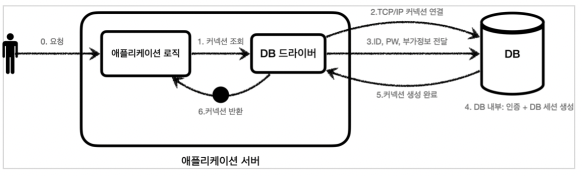

# JDBC 이해

### JDBC 등장 이유

애플리케이션을 개발할 때 중요한 데이터는 대부분 데이터베이스에 보관한다.

**클라이언트**가 **애플리케이션 서버**를 통해 **데이터를 저장하거나 조회**하면, 애플리케이션 서버는 다음 과정을 통해서 데이터베이스를 사용.

#### 애플리케이션 서버와 DB 일반적인 사용법 
1. **커넥션 연결**: 주로 TCP/IP를 사용해서 커넥션을 맺는다.
2. **SQL 전달**: 애플리케이션 서버는 DB가 이해할 수 있는 SQL을 연결된 커넥션을 통해 DB에 전달한다.
3. **결과 응답**: DB는 전달된 SQL을 수행하고 그 결과를 응답한다. 애플리케이션 서버는 응답 결과를 활용한다.

### 문제는 모든 DB의 사용법이 다 달랐다는 것이다.

여기에는 2가지 큰 문제가 있는데..

1. 데이터베이스를 다른 종류의 데이터 베이스로 변경하면, 애플리케이션 서버에 개발된 데이터베이스 사용 코드 함께 변경해야함.
2. 개발자가 각각의 데이터베이스마다 커넥션 연결, SQL 전달, 결과 응답 받는 방법 새로 학습… ㅎㄷㄷ

> 이런 큰 문제를 해결하기 위해 JDBC라는 자바 표준 등장
>

### JDBC 표준 인터페이스

> JDBC(Java Database Connectivity)는 자바에서 데이터베이스에 접속할 수 있도록 하는 자바 API
JDBC는 데이터베이스에서 자료를 쿼리하거나 업데이트하는 방법 제공.

MYSQL, ORACLE, MariaDB, Postgresql 등이 모두 JDBC를 구현한 구현체를 제공한다.

대표적인 3가지 표준 인터페이스 제공.

- `java.sql.Connection` - 연결
- `java.sql.Statement` - SQL을 담은 내용
- `java.sql.ResultSet` - SQL 요청 응답

> 참고 - 표준화의 한계
JDBC의 등장으로 많은 것이 편리해졌지만, 각각의 데이터베이스마다 데이터타입, SQL 등이 조금씩 달랐기 때문에 데이터베이스를 변경하면 JDBC 코드는 변경하지 않아도 되지만, SQL은 해당 데이터베이스에 맞도록 변경해야함..ㅠ
참고로 JPA를 사용하면 각각 데이터베이스마다 다른 SQL을 정의해야하는 문제도 많은 부분 해결 가능!

## 커넥션 풀과 데이터 소스
### 커넥션 풀
#### 데이터베이스 커넥션을 매번 획득?

- 데이터베이스 커넥션을 획득할 때의 과정
1. 애플리케이션 로직은 DB 드라이버를 통해 커넥션을 조회한다.
2. DB 드라이버는 DB와 `TCP/IP` 커넥션을 연결한다. 물론 이 과정에서 3 way handshake 같은 `TCP/IP` 연결을 위한 네트워크 동작이 발생한다.
3. DB 드라이버는 TCP/IP 커넥션이 연결되면 ID, PW와 기타 부가정보를 DB에 전달한다.
4. DB는 ID, PW를 통해 내부 인증을 완료하고, 내부에 DB 세션을 생성한다.
5. DB는 커넥션 생성이 완료되었다는 응답을 보낸다.
6. DB 드라이버는 커넥션 객체를 생성해서 클라이언트에 반환한다.

커넥션을 매 번 새로 만드는 것은 과정도 복잡하고 시간도 많이 소모되는 일이다. 
DB는 물론이고 애플리케이션 서버에서도 `TCP/IP`커넥션을 새로 생성하기 위한 리소스를 매번 사용해야 한다. 
진짜 문제는 고객이 애플리케이션을 사용할 때, SQL을 실행하는 시간 뿐만 아니라 커넥션을 새로 만드는 시간까지 추가된다. 
결과적으로 응답 속도에 영향을 준다. 
 
이런 문제를 한 번에 해결하는 아이디어가 커넥션을 미리 생성해두고 사용하는 커넥션 풀이라는 방법이다. 
커넥션 풀은 커넥션을 관리하는 풀이다.
 

애플리케이션을 시작하는 시점에 커넥션 풀은 필요한 만큼 커넥션을 미리 확보해서 풀에 보관한다. 
기본 값은 보통 10개로 잡는다.
  
이렇게 커넥션 풀에 들어 있는 커넥션은 TCP/IP로 DB와 커넥션이 연결되어 있는 상태이기 때문에 언제든지 즉시 SQL을 DB에 전달할 수 있다.
 
#### 커넥션 풀 사용 1
- 애플리케이션 로직에서 DB 드라이버를 통해서 새로운 커넥션을 획득하지 않는다.
- 커넥션 풀을 통해 이미 생성되어 있는 커넥션을 객체 참조로 가져다 쓴다.
- 커넥션 풀에 커넥션을 요청하면 커넥션 풀은 자신이 가지고 있는 커넥션 중에 하나를 반환한다.
#### 커넥션 풀 사용 2
- 애플리케이션 로직은 커넥션 풀에서 받은 커넥션을 사용해서 SQL을 데이터베이스에 전달하고 그 결과를 받아서 처리한다.
- 커넥션을 모두 사용하고 나면 커넥션을 종료하는 것이 아니라, 해당 커넥션을 그대로 커넥션 풀에 반환한다.

#### 커넥션 풀 정리
- 적절한 커넥션 풀 숫자는 서비스의 특징과 애플리케이션 서버 스펙, DB 서버 스펙에 따라 다르다. 성능 테스트를 통해서 정한다.
- 커넥션 풀은 서버당 최대 커넥션 수를 제한할 수 있다. 따라서 DB에 무한정 연결이 생성되는 것을 막아주어서 DB를 보호하는 효과도 있다.
- 커넥션 풀은 개념적으로 단순해서 직접 구현할 수 있지만, 사용도 편리하고 성능도 뛰어난 오픈소스 커넥션 풀이 많다!
- 대표적인 커넥션 풀 오픈소스는 `commons-dbcp2`, `tomcat-jdbc pool` ,`HikariCP` 등이 있다
- 성능과 사용의 편리함 측면에서 `hikariCP`를 주로 사용한다. 