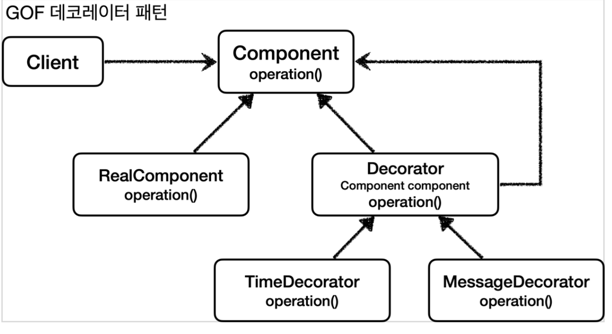

## 프록시 패턴과 데코레이터 패턴
### 클라이언트와 서버
- 일반적으로 클라이언트와 서버라고 하면, 웹 개발자 입장에서는 사용자. 
  즉 웹 브라우저가 클라이언트고 브라우저 요청을 처리하는 쪽이 서버라고 이해한다.
- 하지만 여러 분야에 걸쳐 사용하기도 한다.
- 객체에 대입해 생각한다면, 객체에 행위를 호출하는 쪽이 클라이언트고, 이를 처리하는 쪽이 서버라고 부를 수 있다.
- 프록시는 클라이언트와 서버 사이에서 대리자 역할을 수행한다.
- 예를 들어서 라면을 '내가' 끓일 수도 있지만, 어떤 누구에게 부탁을 할 수도 있는 것이다.
- 그 어떤 누구는 '나 말고 다른' 사람이 될 것이다.
- '어떤 누구'는 라면을 끓이고 김치까지 제공할 수 있다.(부가 기능 추가)
- 그리고 그 '어떤 누구'는 그 사람이 또 다른 '어떤 누구'에게 부탁을 할 수도 있는 것이다.(프록시 체인)
- 또 하나의 예로는, 라면을 끓이기 위해서 라면을 사달라고 '어떤 누구'에게 부탁을 했는데, 이미 라면이 있는 경우도 있을 것이다(접근 제어, 캐싱)
- 이 대리자 역할을 수행하는게 프록시라고 한다.

#### 프록시의 주요 기능
프록시를 통해서 할 수 있는 일은 크게 2가지로 구분할 수 있다.
- 접근 제어
  - 권한에 따른 접근 차단
  - 캐싱
  - 지연 로딩
- 부가 기능 추가
  - 원래 서버가 제공하는 기능에 더해서 부가 기능을 수행한다.
  - 예) 요청 값이나, 응답 값을 중간에 변형한다.
  - 예) 실행 시간을 측정해서 추가 로그를 남긴다.
#### GOF 디자인 패턴
둘 다 프록시를 사용하는 방법이지만, GOF 디자인 패턴에서는 이 둘을 의도(intent)에 따라서 프록시 패턴과 데코레이터 패턴으로 구분!
- 프록시 패턴: 접근 제어가 목적
- 데코레이터 패턴: 새로운 기능 추가가 목적 
#### 참고
=> 참고로 프록시 패턴이라고 프록시와 프록시 패턴이 같은게 아니다. 프록시 패턴이라고 해서 이 패턴만 프록시를 사용하는 것은 아니다. 
=> 데코레이터 패턴도 프록시를 사용한다.

> 참고: 프록시라는 개념은 클라이언트 서버라는 큰 개념 안에서 자연스럽게 발생할 수 있다. 
> 프록시는 객체 안에서의 개념도 있고, 웹 서버에서의 프록시도 있다. 객체 안에서 객체로 구현되어 있는가, 웹 서버로 
> 구현되어 있는가처럼 규모의 차이가 있을 뿐 근본적인 역할은 같다.

### 프록시 패턴과 데코레이터 패턴 정리

여기서 생각해보면 `Decorator` 기능에 일부 중복이 있다. 꾸며주는 역할을 하는 `Decorator` 들은 스스로 
존재할 수 없다. 항상 꾸며줄 대상이 있어야 한다. 따라서 내부에 호출 대상인 `component` 를 가지고 있어야 
한다. 그리고 `component` 를 항상 호출해야 한다. 이 부분이 중복이다. 이런 중복을 제거하기 위해 
`component` 를 속성으로 가지고 있는 `Decorator` 라는 추상 클래스를 만드는 방법도 고민할 수 있다. 
이렇게 하면 추가로 클래스 다이어그램에서 어떤 것이 실제 컴포넌트 인지, 데코레이터인지 명확하게 
구분할 수 있다. 여기까지 고민한 것이 바로 GOF에서 설명하는 데코레이터 패턴의 기본 예제이다. 

### 프록시 패턴 vs 데코레이터 패턴
- `Decorator`라는 추상 클래스를 만들어야 데코레이터 패턴일까?
- 프록시 패턴과 데코레이터 패턴은 그 모양이 거의 비슷한 거 같다.?

#### 의도(indent)
- 사실 프록시 패턴과 데코레이터 패턴은 그 모양이 거의 같고, 상황에 따라 정말 똑같을 때도 있다.
- 그러면 둘을 어떻게 구분하는 것일까?
- 디자인 패턴에서 중요한 것은 해당 패턴의 겉 모양이 아니라 그 패턴을 만든 의도가 더 중요하다.
- 따라서 의도에 따라 패턴을 구분한다.
 
- 프록시 패턴의 의도: 다른 개체에 대한 **접근을 제어**하기 위해 대리자를 제공
- 데코레이터 패턴의 의도: **객체에 추가 책임(기능)을 동적으로 추가**하고, 기능 확장을 위한 유연한 대안 제공
#### 정리
프록시를 사용하고, 해당 프록시가 접근 제어가 목적이라면 프록시 패턴이고, 새로운 기능을 추가하는 것이 목적이라면 데코레이터 패턴이 된다.

### 인터페이스 기반 프록시와 클래스 기반 프록시

#### 인터페이스 기반 프록시 vs 클래스 기반 프록시
- 인터페이스가 없어도 클래스 기반으로 프록시를 생성할 수 있다.
- 클래스 기반 프록시는 해당 클래스에만 적용할 수 있다. 인터페이스 기반 프록시는 인터페이스만 같으면 모든 곳에 적용할 수 있다.
- 클래스 기반 프록시는 상속을 사용하기 때문에 몇가지 제약이 있다.
  - 부모 클래스의 생성자를 호출해야 한다.(앞서 본 예제)
  - 클래스에 final 키워드가 붙으면 상속이 불가능하다.
  - 메서드와 final 키워드가 붙으면 해당 메서드를 오버라이딩 할 수 있다.

이렇게 보면 인터페이스 기반의 프록시가 더 좋아보인다. 맞다. 인터페이스 기반의 프록시는 상속이라는 
제약에서 자유롭다. 프로그래밍 관점에서도 인터페이스를 사용하는 것이 역할과 구현을 명확하게 나누기 
때문에 더 좋다. 
인터페이스 기반 프록시의 단점은 인터페이스가 필요하다는 그 자체이다. 인터페이스가 없으면 인터페이스 
기반 프록시를 만들 수 없다. 

# 동적 프록시 기술
